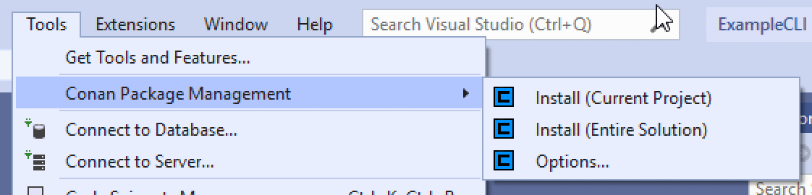
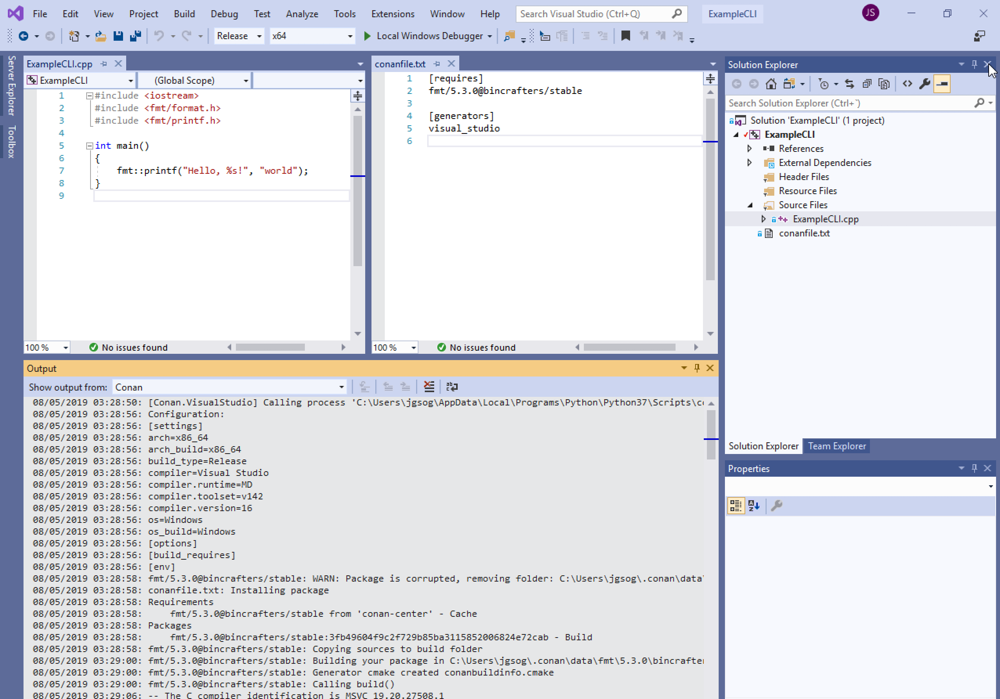

The Conan Extension for Visual Studio automates the use of [Conan, the C/C++ package manager](https://conan.io/),
into your Visual Studio projects. This extension is currently under development, but it already offers the
most common functionalities for a C++ project workflow.

Conan
-----

Conan is an open source package manager, with MIT license, focused in C and C++ programming languages. It
simplifies the process of integrating and reusing C and C++ libraries **from sources and from binaries** too,
giving your team the ability to boost your development speed.

Conan is a decentralized package manager with a client-server architecture. This means that clients can
fetch packages from, as well as upload packages to, different servers/remotes, in a very similar way to
the Git push/pull model.

Visit the [documentation](https://docs.conan.io/en/latest/) to get a complete overview of all the features
and how to use Conan at all its power.

Conan Extension for Visual Studio
---------------------------------

This extension is able to detect a `conanfile.txt` or `conanfile.py` added to your solution, and then it
will download all the project dependencies building them if neccessary. The resulting path and flags will
be added to a `.props` file and included in your solution, so they will be available for you to use
directly from your sources.

Getting started with a basic project should be quite straightforward. Once the extension is installed check
the options of the Conan Extension to be sure that the path to the Conan executable is available
([install Conan](https://conan.io/downloads.html)).

Then you can use the menu to trigger Conan or it will fire automatically when a change is detected.

The next image shows a typical layout of Visual Studio with the extension working:
 * the `conanfile.txt` is added to the solution, it declares the dependencies,
 * the sources make use of the headers provided by the required library,
 * the output window shows the step performed by Conan: it has computed the graph of dependencies,
   downloaded the recipes and built from sources (binaries were not available in the default remote).

 

There is a lot of work ahead, we expect to keep adding functionalities to this plugin; and, if you
come across any issue of you just want to provide feedback, please write in
[our repository](https://github.com/conan-io/conan-vs-extension).

Requirements
------------

Visual Studio 2017 and above
